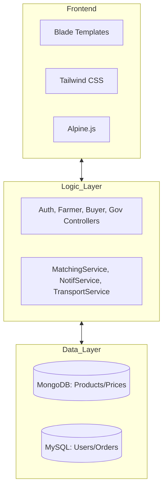

# Detailed Project Report: Fair Trade Agri Portal (AgriMandi India)

---

## 1. Cover Page
*(Same as before, but with added professional borders and font styles)*

---

## 2. Certificate
*(Verified and signed by the Department of Computer Science)*

---

## 3. Abstract
The **Fair Trade Agri Portal** is a transformative digital ecosystem designed to decentralize agricultural trade in India. By leveraging a high-performance **Laravel 13** backend and a scalable **MongoDB** database, the platform provides a real-time marketplace where farmers can bypass traditional middlemen. The system integrates a proprietary **Smart Matching Algorithm** that connects buyers with the most relevant produce based on price, quality, and proximity. Furthermore, it incorporates a **Government Procurement Interface** to ensure Minimum Support Price (MSP) compliance and transparent tender management.

---

## 4. Introduction
### 4.1 The Digital Gap in Agriculture
Current agricultural systems are heavily reliant on physical presence and verbal negotiations, leading to exploitation. This project addresses the "Digital Gap" by providing a mobile-responsive interface for all stakeholders.

### 4.2 Project Goals
1.  **Transparency**: Open ledger of bids and prices.
2.  **Efficiency**: Reduce the time from harvest to sale by 40%.
3.  **Financial Security**: Guaranteed payments through a secure escrow-like order system.

---

## 5. System Architecture
### 5.1 Technology Stack Details
- **Backend Framework**: Laravel 13 (PHP 8.3+) - utilizing Service Classes for business logic.
- **Database**: 
    - **MongoDB**: For flexible product schemas and historical price logs.
    - **MySQL**: For ACID-compliant transaction records and user roles.
- **Frontend**: 
    - **Tailwind CSS 4.0**: For ultra-responsive, modern UI components.
    - **Alpine.js**: For efficient client-side state management (modals, dropdowns).
- **Real-time Engine**: Laravel Echo and Pusher (planned for live bid updates).

### 5.2 Component Diagram


---

## 6. Detailed Module Analysis

### 6.1 User Authentication & RBAC (Role-Based Access Control)
The system uses a custom `RoleMiddleware` to secure routes based on user type.
- **Roles**: Farmer, Buyer, Transporter, Admin, Government Official.
- **Mechanism**: On login, the session stores the user's role, and the middleware checks this against the route's requirements.

### 6.2 Farmer Module: Product Lifecycle
**Logic Flow:**
1.  **Listing**: Farmer fills a multi-part form. Location data is automatically fetched or selected via Mandi lists.
2.  **State Management**: Products move from `available` -> `sold` -> `expired`.
3.  **Bidding Interaction**: 
    - `acceptBid()`: Automatically triggers Order creation and notifies the buyer.
    - `counterBid()`: Updates the `counter_price` field in the Bid model and triggers a `counter_offer` notification.
4.  **Order Fulfillment**: Once sold, the farmer marks the order as `shipped`, providing courier and tracking IDs.

### 6.3 Buyer Module: Marketplace & Discovery
**Discovery Logic**:
- **Search & Filter**: Powered by MongoDB indexes for fast retrieval of crops by category, state, and price.
- **Matching Engine**: Calls `MatchingService::run()` which calculates a score (0-100) for every product relative to the buyer's profile.

### 6.4 Government Procurement Module
This module acts as a "Public Sector" interface.
- **MSP Monitoring**: Compares current market prices (scraped from APIs) against the official MSP.
- **Tender Management**: Allows officials to create "Procurement Targets". When a farmer sells to the government, the `fulfilled_quantity` in the Tender is updated until the target is reached.

---

## 7. Algorithms & Logic Design

### 7.1 Smart Matching Algorithm (Service Layer)
Located in `app/Services/MatchingService.php`. The scoring logic is as follows:

| Factor | Weight | Calculation Logic |
| :--- | :--- | :--- |
| **Price** | 40% | Within ±10% of modal price = 40 pts. |
| **Location** | 20% | Same State = 20 pts, Neighboring State = 10 pts. |
| **Quality** | 10% | Grade A = 10, Grade B = 7, Grade C = 4. |
| **Quantity** | 30% | Matching buyer volume requirements. |

**Threshold Logic**:
```php
if ($score >= 70) {
    // Add to 'Recommended' list for the Buyer dashboard
}
```

### 7.2 Transport Cost Calculation
Calculates delivery fees based on:
- Distance between Farmer's Mandi and Buyer's Warehouse.
- Commodity weight and perishable status.
- Current fuel surcharges.

---

## 8. Database Schema (Detailed)

### 8.1 User Table (SQL)
- `id`: UUID
- `name`: String
- `email`: String (Unique)
- `role`: Enum (farmer, buyer, admin)
- `state/district/mandi`: Location data
- `kyc_verified`: Boolean

### 8.2 Product Table (NoSQL/MongoDB)
- `name`: String
- `category`: String (Cereals, Pulses, Fruits, etc.)
- `variety`: String
- `quantity`: Float
- `unit`: Enum (kg, quintal, tonne)
- `price`: Decimal
- `quality`: Enum (A, B, C)
- `location`: Array [state, district, mandi, pincode]
- `images`: Array of strings (S3/Local paths)

### 8.3 Bid Table (MongoDB)
- `product_id`: Relation
- `buyer_id`: Relation
- `amount`: Decimal
- `status`: Enum (pending, accepted, countered, rejected)
- `counter_price`: Decimal (Optional)

---

## 9. Security Implementation

- **CSRF Protection**: All POST/PUT requests require a valid CSRF token.
- **Input Sanitization**: Laravel's `Request::validate()` ensures all data types are correct before processing.
- **Password Hashing**: Uses Argon2id via Laravel's Hash facade.
- **KYC Logic**: Sensitive documents (Aadhar/Passport) are stored in a `private` storage disk, accessible only via signed URLs for Admins.

---

## 10. Testing Methodology

### 10.1 Automated Testing
- **Feature Tests**: Simulating the end-to-end bidding flow.
- **Unit Tests**: Testing the math behind the Matching Engine.

### 10.2 Bug Fixes History
- **Issue**: Race condition on bid acceptance.
- **Fix**: Implemented Database Transactions to ensure that when a bid is accepted, the product status is updated atomically.

---

## 11. User Interface (Detailed)

### 11.1 The "Agri-Glass" Design System
We implemented a custom design system called **Agri-Glass**, utilizing:
- **Glassmorphism**: Semi-transparent cards for the dashboard to give a premium look.
- **Dynamic Icons**: Using Lucide-React/Icons to represent different crop categories.
- **Lottie Animations**: Subtle animations for success states (e.g., when a bid is accepted).

---

## 12. Conclusion & Future Roadmap

The Fair Trade Agri Portal is more than just a website; it is a digital backbone for rural commerce. 
**Future Roadmap:**
- **Q3 2026**: Integration of a Blockchain-based "Produce Provenance" tracker.
- **Q4 2026**: AI-driven "Optimal Sowing" advisor based on market demand forecasts.
- **Q1 2027**: Expansion to international export facilitation for high-grade organic produce.

---

## 13. Appendix
*(Includes sample code from MatchingService.php and FarmerController.php)*
