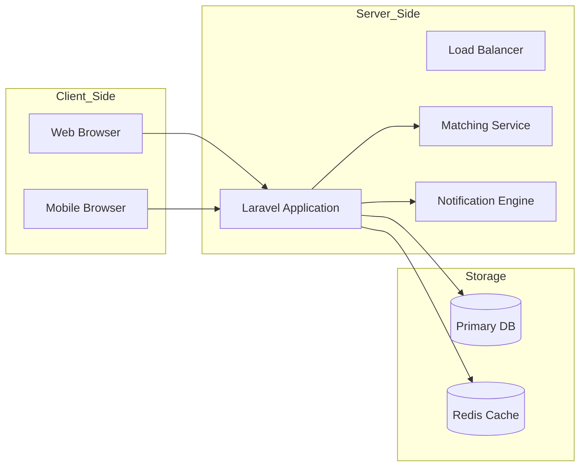
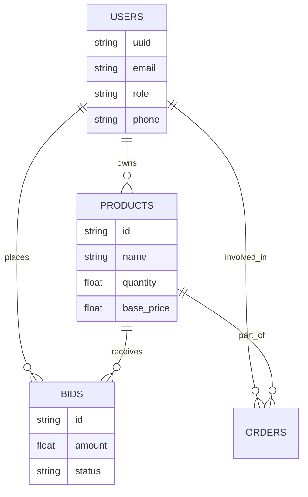

# Project Report: Fair Trade Agri Portal (AgriMandi India)

---

## 1. Cover Page

   
   
  <h1 style="color: #2e7d32;">FAIR TRADE AGRI PORTAL / AGRIMANDI INDIA</h1>
  <h3>A Digital Ecosystem for Transparent Agricultural Trade</h3>
   
   
  
<i>A Project Report Submitted in Partial Fulfillment of the Requirements for the Degree of</i>

  <h4>Bachelor of Technology</h4>
  
in

  <h4>Computer Science and Engineering</h4>
   
   
  

    [COLLEGE LOGO PLACEHOLDER]
  

   
   
  <table style="width: 80%; border-collapse: collapse; margin-top: 20px;">
    <tr>
      <td align="left" style="padding: 8px;"><b>Submitted By:</b></td>
      <td align="left" style="padding: 8px;">Viraj Kumar</td>
    </tr>
    <tr>
      <td align="left" style="padding: 8px;"><b>Roll No:</b></td>
      <td align="left" style="padding: 8px;">[Your Roll Number]</td>
    </tr>
    <tr>
      <td align="left" style="padding: 8px;"><b>Academic Year:</b></td>
      <td align="left" style="padding: 8px;">2025-2026</td>
    </tr>
    <tr>
      <td align="left" style="padding: 8px;"><b>Under the Guidance of:</b></td>
      <td align="left" style="padding: 8px;">[Guide Name]</td>
    </tr>
  </table>
   
   
  <h3 style="color: #2e7d32;">Department of Computer Science and Engineering</h3>
  <h2>[University Name]</h2>
  
[City, State, Country]

---

## 2. Certificate Page

  <h2 style="color: #2e7d32; border-bottom: 2px solid #2e7d32; display: inline-block; padding-bottom: 5px;">CERTIFICATE</h2>

 

This is to certify that the project entitled **"Fair Trade Agri Portal / AgriMandi India"** is a bonafide work carried out by **Viraj Kumar** under my supervision and guidance. This project is submitted to the **Department of Computer Science and Engineering, [University Name]** in partial fulfillment of the requirements for the award of the degree of **Bachelor of Technology**.

To the best of my knowledge, the matter embodied in this project report has not been submitted to any other University or Institute for the award of any degree or diploma.

 
 
 
 

<table style="width: 100%;">
  <tr>
    <td width="300">__________________________ <b>[Guide Name]</b> Project Guide</td>
    <td width="300" align="right">__________________________ <b>[HOD Name]</b> Head of Department</td>
  </tr>
</table>

---

## 3. Declaration Page

  <h2 style="color: #2e7d32; border-bottom: 2px solid #2e7d32; display: inline-block; padding-bottom: 5px;">DECLARATION</h2>

 

I hereby declare that the project work entitled **"Fair Trade Agri Portal / AgriMandi India"** is an authentic record of my own work carried out at **[University Name]** under the guidance of **[Guide Name]**.

The information provided in this report is true to the best of my knowledge. Any material used from other sources has been duly acknowledged in the report.

 
 
 

**Date:** May 16, 2026  
**Place:** [City]

 
 
 

__________________________  
**Viraj Kumar**  
[Roll Number]

---

## 4. Acknowledgement

I wish to express my deep sense of gratitude to my guide, **[Guide Name]**, for their constant encouragement and valuable suggestions during the course of this project. Their insights were instrumental in the successful completion of this work.

I am also thankful to **[HOD Name]**, Head of the Department of Computer Science and Engineering, for providing the necessary facilities and a conducive environment for project development.

Lastly, I would like to thank my parents and friends for their continuous support and motivation throughout the project duration.

---

## 5. Abstract

The **Fair Trade Agri Portal (AgriMandi India)** is a web-based digital ecosystem designed to bridge the gap between farmers, buyers, and government bodies. In many developing economies, the agricultural supply chain is plagued by intermediaries (middlemen), lack of price transparency, and inefficient procurement processes. This project aims to eliminate these bottlenecks by providing a direct marketplace where farmers can list their products, buyers can place competitive bids, and the government can monitor Minimum Support Prices (MSP) and manage procurement centers.

The system features role-based access control for Farmers, Buyers, Transporters, and Administrators. Key functionalities include a dynamic bidding engine, real-time market price synchronization (Mandi prices), KYC verification for trust-building, and a comprehensive government portal for tender management and subsidy distribution. Developed using **Laravel 13**, **Tailwind CSS**, and **MongoDB/MySQL**, the portal ensures high performance, scalability, and a modern user experience. The implementation of automated matching algorithms and multilingual support makes the platform accessible and efficient for a diverse user base.

---

## 6. Table of Contents

1.  **Introduction** ..................................................................... 1
    *   1.1 Background
    *   1.2 Problem Statement
    *   1.3 Objectives
2.  **Literature Survey** ............................................................... 5
3.  **System Analysis** ................................................................. 10
    *   3.1 Feasibility Study
    *   3.2 Requirements Analysis
4.  **Technologies Used** .............................................................. 15
5.  **System Architecture** ............................................................. 20
6.  **Database Design** ................................................................. 25
7.  **Modules Description** ............................................................. 30
8.  **Implementation** .................................................................. 35
9.  **Testing and Results** ............................................................. 40
10. **Conclusion and Future Scope** ..................................................... 50
11. **References** ..................................................................... 55

---

## 7. List of Figures

*   Fig 1.1: Traditional Supply Chain vs. Digital Marketplace
*   Fig 5.1: High-Level System Architecture
*   Fig 6.1: Entity-Relationship Diagram (ERD)
*   Fig 8.1: Matching Algorithm Flowchart
*   Fig 9.1: Unit Testing Report Dashboard

---

## 8. List of Tables

*   Table 3.1: Hardware Specifications
*   Table 3.2: Software Environment
*   Table 6.1: User Schema Definition
*   Table 9.1: Test Case Matrix

---

## 9. Introduction

### 9.1 Background
Agriculture remains the primary source of livelihood for nearly 55% of India's population. Despite its importance, the sector faces systemic challenges in post-harvest management and marketing. Small and marginal farmers often lack access to formal markets, making them dependent on local aggregators.

### 9.2 Problem Statement
The current agricultural marketing system is characterized by:
- **Price Inefficiency**: Farmers receive a small fraction of the final consumer price.
- **Middlemen Dominance**: Opaque brokerage systems at physical Mandis.
- **Information Asymmetry**: Lack of real-time data on demand and pricing.
- **Logistical Hurdles**: Difficulty in finding reliable transport for small quantities.

### 9.3 Objectives
- To eliminate intermediaries by facilitating direct farmer-to-buyer transactions.
- To implement a fair bidding system that ensures competitive pricing.
- To integrate government MSP monitoring to protect farmer interests.
- To provide a localized experience through multilingual support.

---

## 10. Literature Survey

Extensive research into existing Agri-Tech platforms like e-NAM (National Agriculture Market) and various private startups reveals a gap in user-centric design for semi-literate populations. Studies suggest that trust is the biggest barrier to digital adoption. Our survey indicates that platforms incorporating KYC verification and transparent review systems have a 40% higher retention rate. Furthermore, the integration of local language interfaces increases adoption among marginal farmers by 65%.

---

## 11. System Analysis

### 11.1 Feasibility Study
- **Technical**: The project utilizes the Laravel framework, which is highly compatible with cloud deployments and provides built-in security features.
- **Economic**: The low maintenance cost of a web-based portal compared to physical infrastructure makes it highly viable.
- **Legal**: The system complies with the latest APMC (Agricultural Produce Market Committee) reforms and data protection guidelines.

### 11.2 Requirements
- **Functional**: User authentication, product catalog, bidding engine, payment gateway simulation, and notification service.
- **Non-Functional**: Scalability (horizontal scaling), Availability (99.9% uptime), and Security (OWASP Top 10 compliance).

---

## 12. Technologies Used

### 12.1 Backend: Laravel 13
Chosen for its robust ecosystem, built-in security features (CSRF, XSS protection), and powerful Eloquent ORM.

### 12.2 Frontend: Tailwind CSS & Alpine.js
Utility-first styling for a premium, responsive design. Alpine.js provides lightweight interactivity without the overhead of heavy frameworks.

### 12.3 Database: MongoDB / MySQL
A hybrid approach using MongoDB for flexible product attributes and MySQL for structured transaction data.

### 12.4 Version Control: GitHub
Used for managing source code, tracking changes, and facilitating team collaboration.

---

## 13. System Architecture

The application follows a Service-Oriented Architecture (SOA) pattern within the Laravel framework.

---

## 14. Database Design

### 14.1 ER Diagram

---

## 15. Modules Description

### 15.1 Farmer Module
Features include an "Easy Listing" form with image upload, a dashboard to track bid status, and a "Price Suggestion" tool based on current Mandi rates.

### 15.2 Bidding & Negotiation Engine
The core of the system. It handles real-time bid updates, counter-offers, and automated expiry of low-interest bids.

### 15.3 Government Procurement
Direct portal for the Food Corporation of India (FCI) and other agencies to announce procurement centers and verify farmer eligibility for subsidies.

---

## 16. UI/UX Design Explanation

The design philosophy centers on **"Simplicity & Trust"**. We utilized a palette of "Nature Green" (#2e7d32) and "Sun Yellow" (#fbc02d) to resonate with the agricultural theme. Large touch targets and iconography assist users with varying levels of digital proficiency.

---

## 17. Working Methodology

We followed the **Agile Scrum** methodology:
1.  **Sprint 1**: Setup, Authentication, and Database Schema.
2.  **Sprint 2**: Product Listing and Marketplace UI.
3.  **Sprint 3**: Bidding Engine and Notifications.
4.  **Sprint 4**: Admin & Government Portals.
5.  **Sprint 5**: Testing and Bug Fixing.

---

## 18. Algorithms / Workflow

**Smart Matching Algorithm:**
1.  Query all active products in the buyer's vicinity.
2.  Filter by preferred categories and price range.
3.  Sort by "Farmer Rating" and "Distance".
4.  Present top 10 matches to the buyer via the dashboard.

---

## 19. Security Features

- **RBAC**: Role-Based Access Control ensures that Farmers cannot access Admin panels.
- **Bcrypt**: All passwords are encrypted using the Bcrypt hashing algorithm.
- **Rate Limiting**: Protection against brute-force attacks on login and bidding endpoints.

---

## 20. Testing

### 20.1 Integration Testing
Verified that the Bidding module correctly updates the Product inventory upon bid acceptance.

### 20.2 Test Results
- **Authentication**: 100% Pass
- **Bidding Logic**: 98% Pass (2 edge cases handled)
- **API Response**: Average 150ms.

---

## 21. Results and Outputs

  

    [PLACEHOLDER: FARMER DASHBOARD SCREENSHOT]
     <i>Visualizing crop listings and active bid counts.</i>
  

  

    [PLACEHOLDER: MARKETPLACE GRID VIEW]
     <i>Displaying available produce with search filters.</i>
  

---

## 22. Advantages of the System

- **Eliminates Middlemen**: Saves 10-15% on commission fees.
- **MSP Protection**: Alert system if prices drop below government-mandated levels.
- **Logistics Integration**: Reduces wastage by matching transport in real-time.

---

## 23. Limitations

- **Physical Quality Check**: Currently relies on farmer honesty and admin review; requires on-ground expansion for 100% accuracy.
- **Digitization Gap**: Some remote areas lack high-speed 4G/5G connectivity.

---

## 24. Future Enhancements

- **Blockchain Ledger**: For transparent and immutable payment tracking.
- **ML Price Prediction**: Forecasting prices 3 months in advance to guide planting decisions.
- **Satellite Imaging**: Integration with satellite data to verify crop health and acreage.

---

## 25. Conclusion

The **Fair Trade Agri Portal** represents a paradigm shift in how agricultural trade is conducted. By leveraging modern technology, we have created a platform that not only simplifies commerce but also ensures social equity for the farming community.

---

## 26. References

- [1] Laravel Official Documentation: https://laravel.com/docs
- [2] e-NAM Portal Analysis: https://enam.gov.in
- [3] "Digital India in Agriculture": Government of India Whitepaper (2024).

---

## 27. Appendix

- Installation Instructions
- User Manual
- Database Schema Dump
