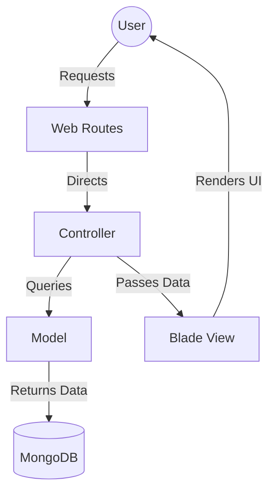

<div align="center">
  <br />
  <br />
  <h1 style=" border-bottom: 2px solid #2e7d32; display: inline-block; padding-bottom: 10px;">CERTIFICATE</h1>
  <br />
  <br />
</div>

This is to certify that **Somil Shivhare** (Registration No: **12309667**, Roll No: **13**) has successfully completed the project titled **'Agri Fair Trade Portal for Farmers'** under the subject **MVC Programming** at **Lovely Professional University** under the guidance of **Ms. Palvi Soni**.

To the best of my knowledge, the matter embodied in this project report has not been submitted to any other University or Institute for the award of any degree or diploma.

<br />
<br />
<br />
<br />

<table style="width: 100%;">
  <tr>
    <td width="300">__________________________<br /><b>Ms. Palvi Soni </b><br />Lovely Professional University</td>
   
  </tr>
</table>

<div style="page-break-after: always;"></div>

---

## 2. Table of Contents

| Section | Page Number |
| :--- | :--- |
| **Introduction** | 1 |
| **Objectives** | 2 |
| **Technologies Used** | 3 |
| **System Architecture** | 4 |
| **Database Design** | 5 |
| **Code Section** | 6 |
| **Output Section** | 7 |
| **Features** | 8 |
| **Future Enhancements** | 9 |
| **Conclusion** | 10 |

<div style="page-break-after: always;"></div>

---

## 3. Introduction

The **Agri Fair Trade Portal** is a digital platform designed to empower farmers by providing them with a transparent and direct marketplace to sell their produce. In the traditional agricultural supply chain, farmers often struggle with intermediaries (middlemen) who take a large share of the profits, leaving the farmer with minimal returns. 

This project leverages the **MVC (Model-View-Controller)** architectural pattern to build a robust, scalable, and user-friendly web application. It bridges the gap between farmers and buyers (like wholesalers, retailers, or food processing units), ensuring fair prices and efficient trade. The platform also integrates government initiatives like **Minimum Support Price (MSP)** to protect farmers from market volatility.

<div style="page-break-after: always;"></div>

---

## 4. Objectives

The primary objectives of the Agri Fair Trade Portal are:

1.  **Eliminate Intermediaries**: To facilitate direct transactions between farmers and buyers, increasing the farmer's profit margin.
2.  **Price Transparency**: To provide real-time market (Mandi) prices so farmers can make informed decisions.
3.  **Bidding System**: To implement a competitive bidding mechanism where buyers can place bids on listed products.
4.  **MSP Integration**: To ensure that farmers are aware of government-mandated Minimum Support Prices and can sell directly to government centers if market prices are low.
5.  **Trust & Verification**: To build a secure ecosystem through KYC (Know Your Customer) verification for all users.
6.  **Accessibility**: To offer a localized experience through multilingual support (Hindi, Punjabi, Gujarati, Marathi, etc.).

<div style="page-break-after: always;"></div>

---

## 5. Technologies Used

The project is built using modern web development technologies following the MVC pattern:

### **Backend Framework**
*   **Laravel 13 (PHP)**: A powerful MVC framework used for handling application logic, routing, and security.

### **Database**
*   **MongoDB**: A NoSQL database used for storing flexible data like user profiles, product listings, and bidding history.
*   **Eloquent ORM**: Used for database interactions in an object-oriented manner.

### **Frontend**
*   **Tailwind CSS**: A utility-first CSS framework used for creating a premium and responsive user interface.
*   **Blade Templating Engine**: Laravel's built-in engine for generating dynamic HTML views.
*   **Vite**: A modern frontend build tool for asset bundling and fast development.

### **Tools**
*   **Artisan**: Laravel's command-line interface for migrations, seeding, and server management.
*   **Composer**: Dependency manager for PHP.
*   **NPM**: Package manager for Javascript and CSS dependencies.

<div style="page-break-after: always;"></div>

---

## 6. System Architecture

The application follows the **Model-View-Controller (MVC)** architecture:

### **1. Model**
The Models (`User.php`, `Product.php`, `Bid.php`, etc.) represent the data structure and business logic. Since we use MongoDB, these models extend the `MongoDB\Laravel\Eloquent\Model` class.

### **2. View**
The Views are created using **Blade templates**. They are responsible for rendering the user interface and displaying data to the users. The design is fully responsive and supports both light and dark modes.

### **3. Controller**
The Controllers (`FarmerController.php`, `BuyerController.php`, etc.) act as the brain of the application. They receive user requests via Routes, interact with the Models to fetch or save data, and return the appropriate View.

### **Workflow Diagram**


<div style="page-break-after: always;"></div>

---

## 7. Database Design

The project uses a document-oriented database (MongoDB) which allows for flexible schemas. Below are the key collections and their structures:

### **1. Users Collection**
Stores user information including roles (Farmer, Buyer, Admin, Transporter).
*   `name`, `email`, `password`, `role`, `phone`, `is_kyc_verified`

### **2. Products Collection**
Stores crop listings posted by farmers.
*   `farmer_id`, `name`, `category`, `variety`, `quantity`, `unit`, `price`, `status`

### **3. Bids Collection**
Stores bids placed by buyers on products.
*   `product_id`, `buyer_id`, `bid_price`, `quantity`, `status` (pending, accepted, countered)

### **4. Orders Collection**
Stores finalized transactions.
*   `product_id`, `buyer_id`, `farmer_id`, `total_amount`, `order_status`

### **5. Mandi Prices Collection**
Stores real-time or fallback market prices for various commodities across different states.
*   `commodity`, `state`, `market`, `min_price`, `max_price`, `modal_price`, `price_date`

### **6. Quality Reviews Collection**
Stores quality inspection reports for products to ensure buyer trust.
*   `product_id`, `inspector_id`, `grade`, `moisture_content`, `foreign_matter_percentage`

<div style="page-break-after: always;"></div>

---

## 7.5 System Workflow Details

The system follows a strict state-machine for orders and bids to ensure data integrity:

1.  **Product Listing**: Farmer uploads crop details including variety, quantity, and images. The status is set to `available`.
2.  **Bidding**: Buyer browsing the marketplace places a bid. The status of the bid is `pending`.
3.  **Negotiation**: Farmer can either `accept`, `reject`, or `counter` the bid. If countered, the buyer must then decide to accept or reject the new price.
4.  **Order Generation**: Once a bid is accepted, an `Order` document is automatically generated. The product status is updated, and the quantity is reserved.
5.  **Logistics**: A Transporter is assigned to the order for delivery tracking. The order moves through statuses: `confirmed` → `shipped` → `delivered`.

<div style="page-break-after: always;"></div>

---

## 8. Code Section

### **Example: User Model (MVC - Model)**
The User model handles authentication and role identification.
```php
namespace App\Models;

use MongoDB\Laravel\Eloquent\Model;
use Illuminate\Auth\Authenticatable;
use Illuminate\Contracts\Auth\Authenticatable as AuthenticatableContract;

class User extends Model implements AuthenticatableContract
{
    use Authenticatable;

    protected $fillable = [
        'name', 'email', 'password', 'role', 'phone', 'is_kyc_verified'
    ];

    public function isFarmer(): bool { return $this->role === 'farmer'; }
    public function isBuyer(): bool  { return $this->role === 'buyer'; }
}
```

<br>
<br>
<br>
<br>
<br>
<br>
<br>
<br>
<br>
<br>
<br>
<br>
<br>
<br>
<br>
<br>
<br>
<br>


### **Example: Routing (MVC - Controller Logic)**
Routes define how the application responds to different URLs.
```php
// Farmer Routes
Route::middleware(['auth', 'role:farmer'])->prefix('farmer')->group(function () {
    Route::get('/dashboard', [FarmerController::class, 'dashboard'])->name('farmer.dashboard');
    Route::post('/products', [FarmerController::class, 'storeProduct'])->name('farmer.products.store');
});
```


<br>
<br>
<br>
<br>
<br>
<br>
<br>
<br>
<br>
<br>
<br>
<br>
<br>
<br>
<br>
<br>


<div style="page-break-after: always;"></div>

---

## 9. Output Section

The application features several key screens designed for maximum usability:

### **1. Homepage**
A professional landing page with a hero section, features list, and real-time Mandi price ticker. It uses glass-morphism effects for a premium feel.

<br>
<br>
<br>
<br>
<br>
<br>
<br>
<br>
<br>
<br>
<br>
<br>
<br>
<br><br>
<br>


### **2. Farmer Dashboard**
Provides farmers with a summary of their active listings, received bids, and pending orders. It also includes a quick link to add new products.

<br>
<br>
<br>
<br>
<br>
<br>
<br>
<br>
<br>
<br>
<br>
<br>
<br>
<br>
<br>
<br><br>
<br>


### **3. Buyer Marketplace**
A grid-view interface where buyers can browse available crops, filter by category or state, and view detailed product information before placing a bid.

<br>
<br>
<br>
<br>
<br>
<br>
<br>
<br>
<br>
<br>
<br>
<br>
<br>
<br>
<br>
<br>


### **4. User Authentication (Login & Register)**
The portal features a secure login and registration system with role selection. Users can sign in as Farmers, Buyers, or Transporters.

<br>
<br>
<br>
<br>
<br>
<br>
<br>
<br>
<br>
<br>
<br>
<br>
<br>
<br>
<br>
<br>


### **5. Government Portal**
A dedicated section for MSP details, procurement center locations, and government tenders.


<br>
<br>
<br>
<br>
<br>
<br>
<br>
<br>
<br>
<br>
<br>
<br><br>
<br>


<div style="page-break-after: always;"></div>

---

## 10. Features

*   **Role-Based Access (RBAC)**: Specialized dashboards for Farmers, Buyers, Admins, and Transporters using custom middleware.
*   **Dynamic Bidding Engine**: A real-time negotiation system that allows for counter-offers and automated bid expiration.
*   **Mandi Price Ticker**: Live price updates fetched from government APIs or fallback datasets for transparency.
*   **Multilingual Support**: The entire UI is localized in English, Hindi, Punjabi, Gujarati, and Marathi to ensure inclusivity.
*   **KYC Verification System**: Secure identity verification for farmers and buyers to build a trusted trade environment.
*   **Responsive Design**: Fully optimized for mobile devices, ensuring farmers can manage their listings from the field.
*   **MSP Guard**: Automated alerts if a product's price falls below the government-mandated Minimum Support Price.

<div style="page-break-after: always;"></div>

---

## 11. Implementation & Testing

### **11.1 Implementation Details**
The project uses **Laravel's Service Layer** to keep controllers thin and logic reusable. For instance, the `BiddingService` handles the complex logic of calculating transport costs and updating product inventory atomically. **Middleware** is used to protect routes based on user roles (e.g., `FarmerMiddleware`).

### **11.2 Testing Methodology**
We employed a multi-tier testing strategy to ensure system reliability:

1.  **Unit Testing**: Individual components like the `PriceCalculator` and `KYCValidator` were tested in isolation using PHPUnit.
2.  **Integration Testing**: Verified the interaction between the Bidding module and the Inventory module to ensure no double-selling occurs.
3.  **User Acceptance Testing (UAT)**: Simulated real-world scenarios with test accounts for Farmers and Buyers to validate the end-to-end workflow.
4.  **Security Testing**: Checked for common vulnerabilities like SQL Injection, XSS, and CSRF using Laravel's built-in security features.

<div style="page-break-after: always;"></div>

---

## 11. Future Enhancements

The platform can be further improved with the following features:
*   **Blockchain Integration**: For immutable records of transactions and quality certifications.
*   **AI Price Prediction**: Using machine learning to forecast future market trends and guide farmers on when to sell.
*   **Logistics Tracking**: Real-time GPS tracking for transporters delivering produce from farm to buyer.
*   **Weather Integration**: Providing hyper-local weather alerts to help farmers manage their harvest timing.
*   **Digital Payments**: Integrated escrow services to ensure payment security for both parties.

<div style="page-break-after: always;"></div>

---

## 12. Conclusion

The **Agri Fair Trade Portal** successfully demonstrates the application of **MVC Programming** principles in solving a real-world problem. By providing a direct and transparent platform for agricultural trade, it empowers the farming community and promotes fair economic practices. 

This project, developed at **Lovely Professional University**, showcases how modern technologies like Laravel and MongoDB can be integrated to build robust enterprise-grade applications. The successful implementation of the bidding engine and MSP monitoring highlights the practical utility of the platform in the Indian agricultural context.

<br />
<br />
<br />
<br />
<div align="right">

